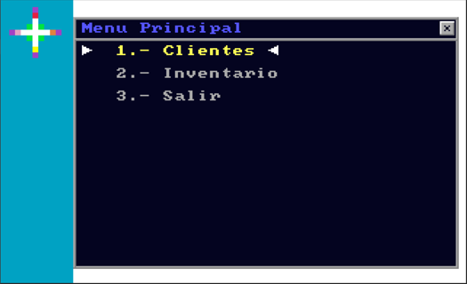
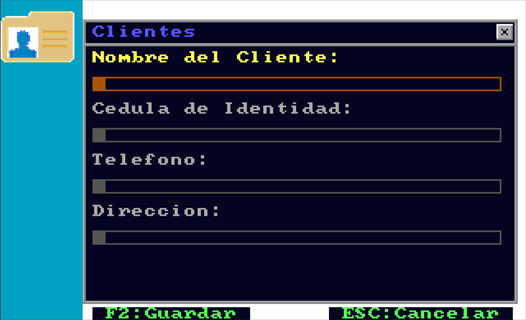
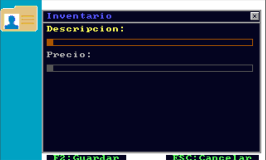
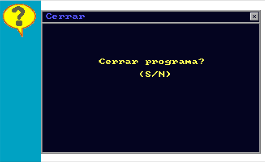

### 📜 Retro GUI Engine - QBX 7.1 (MS-DOS)

### 📸 Capturas de Pantalla / Screenshots

[Español](#español) | [English](#english)

### Español

### 🌟 Acerca del Proyecto

Este repositorio contiene una joya arqueológica de la programación: un **motor de interfaz gráfica de usuario (GUI) dinámico** desarrollado en **QuickBasic Extended 7.1 (QBX)** para entornos MS-DOS.

A diferencia de los programas lineales tradicionales de la época, este software fue diseñado como un **framework guiado por datos (Data-Driven)**. El binario principal funciona como un intérprete que lee archivos de configuración de texto estructurado para renderizar menús, ejecutar acciones de navegación y generar formularios dinámicos de captura de datos en pantalla.

### 🛠️ Características Técnicas Detalladas

**Gráficos de Alta Velocidad (SCREEN 13):** Manipulación directa de la memoria de video VGA mediante inyección en el segmento de memoria física &HA000 con instrucciones BLOAD.

**Sincronización de Hardware (V-Sync):** Uso del puerto de hardware &H3DA (WAIT &H3DA, 8, 8) para detener el renderizado durante el retorno vertical del monitor CRT, eliminando por completo el parpadeo visual (*flickering*).

***Cinemáticas de Paleta de Color:** Rutinas matemáticas personalizadas de interpolación lineal para efectos de fundido a negro (*FadeOUT*) y aclarado (*FadeIN*) modificando directamente los DAC de la tarjeta de video (OUT &H3C9).

**Estructura Extensible:** Intérprete de scripts basado en prefijos de comandos (T:, I:, M:, B:, E:) para desacoplar completamente la lógica del programa del contenido visual.

**Persistencia de Datos:** Sistema de almacenamiento secuencial indexado (APPEND) que actúa como una base de datos rudimentaria para la captura de formularios.

### 🚀 Cómo Ejecutarlo Hoy

Para revivir y ejecutar este código en sistemas operativos modernos (Windows, macOS o Linux), se recomienda utilizar:

1. **DOSBox-X:** Configurando el mapa de caracteres o portapapeles para interactuar con el entorno.

2. **QB64:** Un clon moderno que compila el código QBX de forma nativa en sistemas actuales.

### English

### 🌟 About the Project

This repository contains a software archaeology gem: a **Dynamic Graphical User Interface (GUI) Engine** developed in **QuickBasic Extended 7.1 (QBX)** for MS-DOS environments.

Unlike traditional linear programs of that era, this software was architected as a **Data-Driven Framework**. The main engine acts as an interpreter that reads structured text configuration files to dynamically render menus, handle navigation actions, and generate data entry forms on the fly.

### 🛠️ Technical Deep Dive

**High-Speed Graphics (SCREEN 13):** Direct manipulation of the VGA video RAM by buffering and blasting binary images directly into the physical memory segment &HA000 using BLOAD instructions.

**Hardware Synchronization (V-Sync):** Utilization of the &H3DA hardware port (WAIT &H3DA, 8, 8) to halt rendering during the CRT monitor's vertical retrace, completely eliminating screen flickering.

**Palette Animation Mechanics:** Custom linear interpolation mathematical routines for smooth transition effects (*FadeOUT* and *FadeIN*) by writing directly to the video card's DAC registers (OUT &H3C9).

**Extensible Architecture:** Script parser based on custom command prefixes (T:, I:, M:, B:, E:) to completely decouple core engine logic from visual content.

**Data Persistence:** Sequential indexed storage mechanism (APPEND) acting as a rudimentary flat-file database for form capture.

### 🚀 How to Run It Today

To run and test this vintage codebase on modern operating systems (Windows, macOS, or Linux), it is highly recommended to use:

1. **DOSBox-X:** Setting up clipboard integration to easily interact with the host OS.

2. **QB64:** A modern compiler backend that brings native compatibility for QBX code to current platforms.

*Proyecto rescatado de disquetes antiguos de los 90/00s. Preservando la historia del desarrollo de software.*
